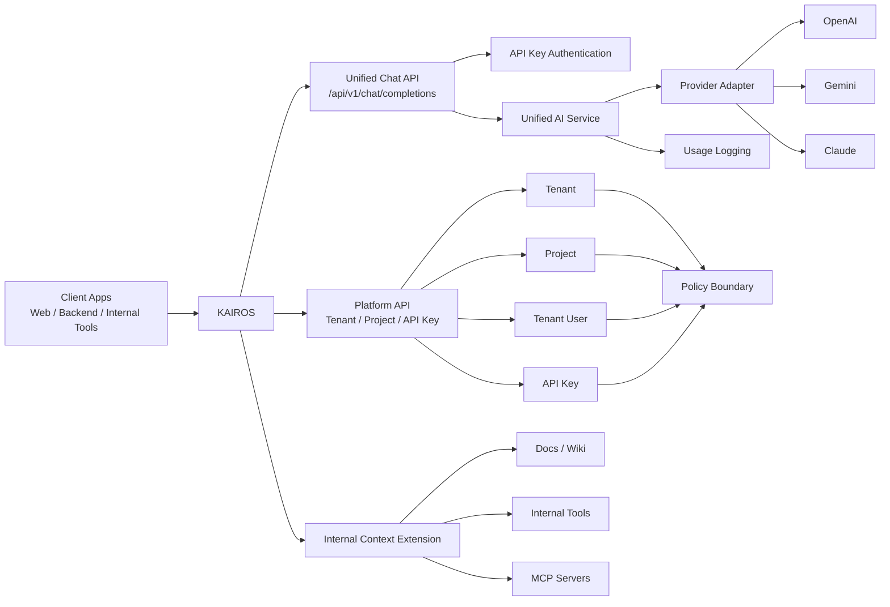

# KAIROS

> Enterprise AI Gateway and Operations Platform

KAIROS는 기업 내부에서 AI를 더 안전하고, 일관되게, 운영 가능하게 만들기 위한 백엔드 플랫폼입니다.

단순히 여러 LLM API를 중계하는 프록시가 아니라,  
인증과 권한, 모델 라우팅, 비용 통제, 장애 대응, 관측 가능성, 그리고 내부 문서·도구·시스템 연결까지 하나의 계층에서 관리하는 **Enterprise AI Gateway**를 목표로 합니다.

즉, KAIROS는 "모델을 대신 호출해주는 서버"가 아니라  
**조직이 AI를 실제 업무와 서비스에 도입할 때 필요한 운영 문제를 해결하는 플랫폼**입니다.

## 아키텍처 개요

현재 범위에서는 **Unified AI API**, **API key 인증**, **tenant / project 기반 운영 경계**, **Provider Adapter**, **사용량 추적의 출발점**까지를 먼저 구현합니다.  
이후 필요에 따라 내부 문서 검색, Tool Calling, MCP 기반 확장으로 자연스럽게 이어질 수 있도록 구조를 잡고 있습니다.

## 왜 KAIROS가 필요한가

AI 기능을 서비스나 사내 업무에 붙이기 시작하면 금방 이런 문제가 생깁니다.

- 팀마다 선호하는 AI API 형식이 다릅니다.
- 모델 제공자마다 요청 방식, 가격, 장애 특성이 다릅니다.
- 어떤 팀이 어떤 모델을 얼마나 쓰는지 파악하기 어렵습니다.
- 비용, 에러율, 응답시간을 중앙에서 관리하기 어렵습니다.
- 특정 provider 장애가 여러 서비스에 동시에 영향을 줄 수 있습니다.
- quota, rate limit, budget 같은 운영 정책이 필요합니다.
- 사내 AI는 문서, 위키, 코드, 운영 도구 같은 내부 컨텍스트에 안전하게 접근해야 합니다.

KAIROS는 이런 문제를 "모델 호출"이 아니라  
**모델 위의 운영 계층**을 표준화하는 방식으로 해결하려고 합니다.

## KAIROS가 지향하는 것

KAIROS는 다음을 중앙에서 다루는 플랫폼을 지향합니다.

- 여러 AI provider를 공통 실행 계층으로 추상화
- tenant, project 단위 인증과 권한 관리
- API key 기반 호출 통제
- 모델 라우팅, fallback, retry 같은 장애 대응
- 사용량, 비용, 에러율, 지연시간 추적
- quota, rate limit, budget 정책 적용
- 내부 문서와 도구 연결을 위한 확장 지점 제공
- 향후 RAG, Tool Calling, MCP 통합까지 이어질 수 있는 구조

한마디로 정리하면:

> KAIROS는 기업이 AI를 "호출"하는 것을 넘어서,  
> **통제하고, 추적하고, 운영할 수 있게 만드는 플랫폼**입니다.

## 어떤 환경에 잘 맞는가

KAIROS는 특히 이런 환경에 잘 맞습니다.

- 여러 팀이 공통 AI 인프라를 함께 써야 하는 조직
- AI 사용량과 비용을 중앙에서 관리해야 하는 환경
- 특정 모델에 종속되지 않고 운영 유연성을 확보하고 싶은 경우
- 내부 문서, 사내 시스템, 운영 도구를 AI와 연결하려는 경우
- 향후 MCP, Tool Calling, RAG 같은 구조까지 확장하려는 경우

작은 서비스에서 단일 모델만 빠르게 붙이는 용도라면 과할 수 있습니다.  
하지만 여러 팀, 여러 기능, 여러 정책이 엮이기 시작하면 KAIROS 같은 운영 계층의 필요성이 분명해집니다.

## 핵심 개념

### Tenant

조직 경계입니다.  
부서, 팀, 본부, 워크스페이스처럼 정책과 비용을 함께 관리할 수 있는 단위로 사용할 수 있습니다.

### Project

실제 AI 기능 단위입니다.  
예를 들면 사내 문서 검색, 고객 응대 봇, 코드 리뷰 도우미, 장애 분석 보조 도구 같은 개별 서비스를 의미합니다.

### Tenant User

tenant에 속한 사용자와 역할을 정의합니다.  
이를 통해 누가 어떤 tenant와 project를 운영할 수 있는지 통제할 수 있습니다.

### API Key

project 단위 호출 자격 증명입니다.  
AI API 호출을 project 단위로 분리하고, 사용량과 비용을 추적하며, 정책을 적용하는 기준점이 됩니다.

## KAIROS의 포지션

KAIROS는 단순한 멀티 LLM 프록시가 아닙니다.

KAIROS가 진짜로 풀고 싶은 문제는 다음과 같습니다.

- AI 모델 접근을 어떻게 통제할 것인가
- 내부 컨텍스트 접근을 어떻게 안전하게 열어줄 것인가
- 어떤 팀이 어떤 정책 아래 어떤 AI 기능을 쓰는지 어떻게 관리할 것인가
- 비용과 장애를 어떻게 운영 관점에서 다룰 것인가

그래서 KAIROS는 다음 세 가지를 함께 묶는 방향을 지향합니다.

- **AI Gateway**
- **운영 정책 플랫폼**
- **사내 AI 실행 기반**

## 앞으로의 방향

가까운 단계에서는 다음을 우선 만듭니다.

1. Unified AI API
2. Provider Adapter 구조
3. API key 인증
4. 사용량 및 비용 로깅
5. tenant / project 기반 운영 경계

그다음 단계에서는 아래로 확장할 수 있습니다.

- RAG 연동
- Tool Calling
- MCP 기반 내부 도구 연결
- 정책 엔진 고도화
- Budget / Quota 자동화
- 대시보드와 운영 콘솔

## 한 줄 소개

**KAIROS는 기업이 외부 AI 모델을 쓰더라도, 내부 정책과 운영 통제를 유지한 채 AI를 서비스와 업무에 연결할 수 있게 만드는 Enterprise AI Gateway입니다.**
