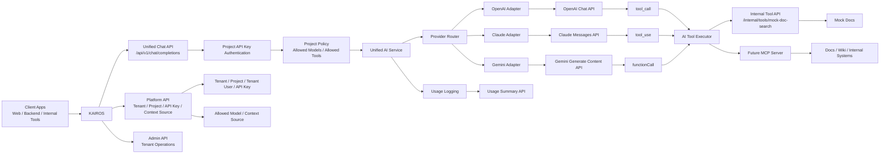

# KAIROS

> Enterprise AI Gateway and Operations Platform

KAIROS는 기업 내부에서 AI를 더 안전하고, 일관되게, 운영 가능하게 만들기 위한 백엔드 플랫폼입니다.

단순히 여러 LLM API를 중계하는 프록시가 아니라,  
인증과 권한, 모델 라우팅, 비용 통제, 장애 대응, 관측 가능성, 그리고 내부 문서·도구·시스템 연결까지 하나의 계층에서 관리하는 **Enterprise AI Gateway**를 목표로 합니다.

즉, KAIROS는 "모델을 대신 호출해주는 서버"가 아니라  
**조직이 AI를 실제 업무와 서비스에 도입할 때 필요한 운영 문제를 해결하는 플랫폼**입니다.

## 아키텍처 개요



현재 범위에서는 **Unified Chat API 연결**, **OpenAI / Claude / Gemini 연동**, **API key 인증**, **tenant / project 기반 운영 경계**, **Provider Router / Adapter**, **AI 사용량 로깅과 tenant/project 단위 사용량 집계 API**까지 구현했습니다.

여기에 더해 project별로 허용된 **Context Source**를 provider별 tool/function schema로 변환하고, OpenAI `tool_call`, Claude `tool_use`, Gemini `functionCall` 흐름을 통해 내부 문서 검색 API를 호출하는 구조까지 확장했습니다.

## 현재 구현된 범위

- JWT 기반 회원가입, 로그인, refresh token 인증 흐름
- ADMIN 전용 tenant 생성 및 전체 tenant 목록 조회 API
- tenant user 기반 OWNER/ADMIN/MEMBER 역할 관리
- tenant 아래 project 생성 및 목록 조회
- project 단위 API key 발급, 목록 조회, 만료/폐기 상태 검증
- `/api/v1/chat/completions` 단일 Unified Chat API
- OpenAI, Claude, Gemini provider adapter와 model 기반 router
- API key 기반 AI 호출 인증
- project별 허용 모델 정책 관리와 AI 호출 차단
- 성공/실패 AI 사용량 로그 저장
- QueryDSL 기반 tenant/project 사용량 요약, project별 breakdown, provider/model별 breakdown 조회
- project별 context source 등록, 조회, 연결 해제 API
- context source를 공통 tool definition으로 변환하는 Tool Catalog
- OpenAI, Claude, Gemini tool calling 흐름 지원
- 내부 mock 문서 검색 API를 통한 MCP 확장 흐름 검증
- Flyway 기반 PostgreSQL 스키마 관리
- Swagger 문서화, traceId 기반 요청 로그, Testcontainers 통합 테스트

## 왜 KAIROS가 필요한가

AI 기능을 서비스나 사내 업무에 붙이기 시작하면 금방 이런 문제가 생깁니다.

- 팀마다 선호하는 AI API 형식이 다릅니다.
- 모델 제공자마다 요청 방식, 가격, 장애 특성이 다릅니다.
- 어떤 팀이 어떤 모델을 얼마나 쓰는지 파악하기 어렵습니다.
- 비용, 에러율, 응답시간을 중앙에서 관리하기 어렵습니다.
- 특정 provider 장애가 여러 서비스에 동시에 영향을 줄 수 있습니다.
- quota, rate limit, budget 같은 운영 정책이 필요합니다.
- 사내 AI는 문서, 위키, 코드, 운영 도구 같은 내부 컨텍스트에 안전하게 접근해야 합니다.
- 내부 문서를 AI와 연결할 때 "어떤 project가 어떤 문서/도구까지 사용할 수 있는가"를 통제해야 합니다.

KAIROS는 이런 문제를 "모델 호출"이 아니라  
**모델 위의 운영 계층**을 표준화하는 방식으로 해결하려고 합니다.

## KAIROS가 지향하는 것

KAIROS는 다음을 중앙에서 다루는 플랫폼을 지향합니다.

- 여러 AI provider를 공통 실행 계층으로 추상화
- tenant, project 단위 인증과 권한 관리
- API key 기반 호출 통제
- project별 허용 모델 정책 적용
- 모델 라우팅, fallback, retry 같은 장애 대응
- 사용량, 비용, 에러율, 지연시간 추적
- quota, rate limit, budget 정책 적용
- 내부 문서와 도구 연결을 위한 확장 지점 제공
- Tool Calling과 MCP 기반 내부 컨텍스트 연동
- 향후 RAG, MCP, 사내 검색 서버까지 이어질 수 있는 구조

한마디로 정리하면:

> KAIROS는 기업이 AI를 "호출"하는 것을 넘어서,  
> **통제하고, 추적하고, 운영하고, 내부 도구와 안전하게 연결할 수 있게 만드는 플랫폼**입니다.

## 어떤 환경에 잘 맞는가

KAIROS는 특히 이런 환경에 잘 맞습니다.

- 여러 팀이 공통 AI 인프라를 함께 써야 하는 조직
- AI 사용량과 비용을 중앙에서 관리해야 하는 환경
- 특정 모델에 종속되지 않고 운영 유연성을 확보하고 싶은 경우
- 내부 문서, 사내 시스템, 운영 도구를 AI와 연결하려는 경우
- project별로 사용할 수 있는 모델과 문서 범위를 제한해야 하는 경우
- 향후 MCP, Tool Calling, RAG 같은 구조까지 확장하려는 경우

작은 서비스에서 단일 모델만 빠르게 붙이는 용도라면 과할 수 있습니다.  
하지만 여러 팀, 여러 기능, 여러 정책이 엮이기 시작하면 KAIROS 같은 운영 계층의 필요성이 분명해집니다.

## 핵심 개념

### Tenant

조직 경계입니다.  
부서, 팀, 본부, 워크스페이스처럼 정책과 비용을 함께 관리할 수 있는 단위로 사용할 수 있습니다.

### Tenant User

tenant에 속한 사용자와 역할을 정의합니다.  
이를 통해 누가 어떤 tenant와 project를 운영할 수 있는지 통제할 수 있습니다.

### Project

실제 AI 기능 단위입니다.  
예를 들면 사내 문서 검색, 고객 응대 봇, 코드 리뷰 도우미, 장애 분석 보조 도구 같은 개별 서비스를 의미합니다.

### API Key

project 단위 호출 자격 증명입니다.  
AI API 호출을 project 단위로 분리하고, 사용량과 비용을 추적하며, 정책을 적용하는 기준점이 됩니다.

### Allowed Model

project에서 호출할 수 있는 모델 목록입니다.  
같은 KAIROS를 사용하더라도 project마다 OpenAI, Claude, Gemini 중 어떤 모델을 허용할지 다르게 관리할 수 있습니다.

### Context Source

AI가 응답을 만들 때 사용할 수 있는 내부 문서 검색 API, 내부 도구, MCP gateway 같은 연결 지점입니다.  
KAIROS는 context source를 provider별 tool/function schema로 변환해 AI에게 알려주고, 실제 tool 실행은 KAIROS가 대신 수행합니다.

## Tool Calling 흐름

KAIROS의 최신 확장 방향은 **project가 허용한 내부 도구만 AI가 사용할 수 있게 만드는 것**입니다.

1. Client가 project API key로 `/api/v1/chat/completions`를 호출합니다.
2. KAIROS가 API key를 인증하고 project를 찾습니다.
3. project에 허용된 모델인지 확인합니다.
4. project에 연결된 context source 목록을 조회합니다.
5. context source를 공통 `AiToolDefinition`으로 변환합니다.
6. provider adapter가 OpenAI, Claude, Gemini 형식에 맞게 tool schema로 변환합니다.
7. AI provider가 필요한 경우 tool call을 선택합니다.
8. KAIROS가 해당 tool이 project에 허용된 것인지 다시 검증합니다.
9. KAIROS가 context source의 `uri`로 내부 tool API를 호출합니다.
10. tool 결과를 다시 provider에 전달합니다.
11. provider의 최종 응답을 client에 반환하고 사용량을 DB에 저장합니다.

이 구조 덕분에 AI가 내부 문서를 직접 마음대로 여는 것이 아니라,  
KAIROS가 허용된 tool만 실행하고 결과만 다시 모델에 전달합니다.

## Context Source 예시

project에 내부 문서 검색 tool을 연결하는 예시입니다.

```http
POST /api/platform/projects/{projectId}/context-sources
Authorization: Bearer {access_token}
Content-Type: application/json
```

```json
{
  "name": "hr_policy_search",
  "type": "MCP_SERVER",
  "description": "연차, 휴가, 재택근무, 복지, 인사 규정, 휴직, 경조사, 근태에 대한 질문이 들어오면 사용한다. 사내 HR 정책 문서에서 관련 내용을 검색한다. 개인 급여, 인사평가, 징계 기록 같은 개인 민감정보 조회에는 사용하지 않는다.",
  "uri": "http://localhost:8080/internal/tools/mock-doc-search"
}
```

`description`은 AI가 어떤 상황에서 이 tool을 선택해야 하는지 판단하는 중요한 힌트입니다.  
너무 짧게 쓰면 tool 선택률이 떨어지고, 너무 넓게 쓰면 불필요한 tool call이 늘어날 수 있습니다.

## 내부 Mock Tool

현재는 MCP 서버를 바로 붙이기 전에, KAIROS 내부에 임시 문서 검색 API를 두어 tool calling loop를 검증합니다.

```http
POST /internal/tools/mock-doc-search
Content-Type: application/json
```

```json
{
  "query": "연차 휴가 정책"
}
```

이 API는 하드코딩된 문서 목록에서 간단히 검색해 결과를 반환합니다.  
나중에 실제 사내망 MCP 서버나 검색 서버로 분리할 때는 `context_source.uri`만 외부 MCP gateway 주소로 바꾸는 방향을 지향합니다.

운영 환경에서는 `/internal/tools/**` 같은 내부 tool endpoint를 외부에 공개하지 않아야 합니다.  
실제 배포에서는 사내망 격리, service token, mTLS, allowlist, gateway 인증 같은 보호 장치를 두는 것이 전제입니다.

## 사용량 추적

KAIROS는 AI 호출 결과를 `ai_usage_log`에 저장합니다.

저장 대상은 project, API key, provider, model, input/output/total token, latency, status, error code, provider response id입니다.  
이를 기반으로 tenant에서 project로, project에서 provider/model로 드릴다운하는 사용량 조회 API를 제공합니다.

대표 API는 다음과 같습니다.

- `GET /api/platform/tenants/{tenantId}/ai-usage/summary`
- `GET /api/platform/projects/{projectId}/ai-usage/summary`

## KAIROS의 포지션

KAIROS는 단순한 멀티 LLM 프록시가 아닙니다.

KAIROS가 진짜로 풀고 싶은 문제는 다음과 같습니다.

- AI 모델 접근을 어떻게 통제할 것인가
- 내부 컨텍스트 접근을 어떻게 안전하게 열어줄 것인가
- 어떤 팀이 어떤 정책 아래 어떤 AI 기능을 쓰는지 어떻게 관리할 것인가
- 비용과 장애를 어떻게 운영 관점에서 다룰 것인가
- AI가 내부 도구를 사용할 때 실행 경계를 어떻게 제한할 것인가

그래서 KAIROS는 다음 세 가지를 함께 묶는 방향을 지향합니다.

- **AI Gateway**
- **운영 정책 플랫폼**
- **사내 AI 실행 기반**

## 앞으로의 방향

가까운 단계에서는 다음을 우선 만듭니다.

1. 내부 mock tool을 별도 MCP gateway 또는 사내 검색 서버로 분리
2. context source별 인증 방식, timeout, retry, error handling 추가
3. 사용자별 문서 접근 권한과 보안 등급 정책 추가
4. API key별 rate limit, quota, budget 정책
5. provider timeout, retry, fallback 정책
6. Prometheus/Grafana 기반 관측 지표 추가
7. 운영 대시보드와 사용량 시각화

그다음 단계에서는 아래로 확장할 수 있습니다.

- RAG 연동
- MCP 기반 내부 도구 연결
- 정책 엔진 고도화
- Budget / Quota 자동화
- 대시보드와 운영 콘솔
- project별 문서/도구 접근 scope 정책

## 한 줄 소개

**KAIROS는 기업이 외부 AI 모델을 쓰더라도, 내부 정책과 운영 통제를 유지한 채 AI를 서비스와 업무에 연결할 수 있게 만드는 Enterprise AI Gateway입니다.**
